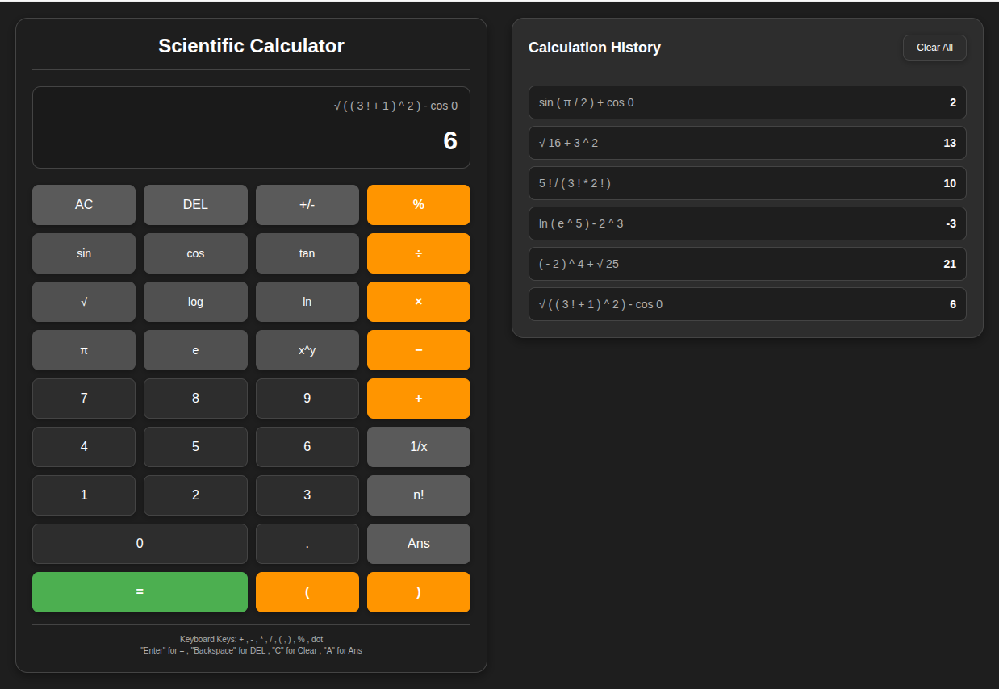

# Scientific Calculator

## Overview

This project is an assessment implementing modular, extensible scientific calculator built with JavaScript. It supports a wide range of arithmetic and scientific operations, including trigonometric, logarithmic, and power functions. The codebase is designed with object-oriented principles and loose coupling, making it easy to maintain, extend, and test.

## Live demo

- [Click Here to Try the Calculator](https://jaimin-dekavadiya-simform.github.io/assessment_calculator/)

## Features

- **Basic Arithmetic:** Addition, subtraction, multiplication, division, modulus.
- **History:** Save, Clear or Use previously evaluated Expression.
- **Scientific Functions:** Trigonometric (sin, cos, tan), logarithmic (log, ln), square root, power, factorial.
- **Constants:** π (PI), e (Euler's number).
- **Parentheses Support:** Nested and complex expressions.
- **Unary Operators:** Negation, reciprocal, toggle sign.
- **Calculation History:** Persistent history using localStorage.
- **Keyboard Shortcuts:** Full keyboard support for input and actions.
- **Theme Toggle:** Light/Dark mode.
- **Error Handling:** Graceful handling of invalid input, math errors, and malformed expressions.
- **Extensible:** Easily add, remove, or modify operators and functions.

## System Workflow

1. **User Input:** User enters an expression via UI or keyboard.
2. **Tokenization:** The input string is converted into tokens (numbers, operators, functions, constants, brackets) by the Tokenizer.
3. **Parsing:** The Parser converts the token stream into Reverse Polish Notation (RPN) using the shunting-yard algorithm, validating structure and precedence.
4. **Evaluation:** The Evaluator computes the result from the RPN tokens using a stack-based approach.
5. **Display & History:** The result is displayed and saved to history. Errors are shown with user-friendly messages.

**Workflow Diagram:**

```
[User Input]  →  [Tokenizer]  →  [Parser](RPN)  →  [Evaluator]  →  [Controller]  →  [UI]
```

## How to Run

1. **Clone the Repository:**

   ```bash
   git clone <repository-url>
   cd Calculator
   ```

2. **Open in Browser:**
   - Open `index 1.html` in your web browser.
   - No build step or server is required; all logic runs in the browser.

3. **Run Tests (Optional):**
   - Uncomment the test runner script in `index 1.html`:
     ```html
     <!-- <script src="src/test/testRunner.js" type="module" defer></script> -->
     ```
     to
     ```html
     <script src="src/test/testRunner.js" type="module" defer></script>
     ```
   - Uncomment the Tests you want to run inside `testRunner.js` file inside `test` Folder.
     ```javascript
     // await import("./sampleTest.js");
     ```
     to
     ```javascript
     await import("./sampleTest.js");
     ```
   - Reload the page to see test results in the browser console.

## Project Structure

```
project-root/
│
├── index.html
├── README.md
│
├── src/
│   ├── main.js
│   │
│   ├── calculator/
│   │   ├── calculator.js
│   │   ├── evaluator.js
│   │   ├── history.js
│   │   ├── operations.js
│   │   ├── parser.js
│   │   └── tokenizer.js
│   │
│   ├── test/
│   │   ├── calculatorControllerTest.js
│   │   ├── calculatorTest.js
│   │   ├── evaluatorTest.js
│   │   ├── operatorTest.js
│   │   ├── parserTest.js
│   │   ├── stackTest.js
│   │   └── testRunner.js
│   │
│   ├── UI/
│   │   └── calculatorController.js
│   │
│   └── utils/
│       ├── stack.js
│       └── utils.js
│
└── styles/
    └── style.css
```

## Extending the Calculator

### Adding a New Operator or Function

1. **Edit `src/calculator/operations.js`:**
   - Add a new entry to the `operators` or `functions` Map.
   - Example (adding XOR operator):
     ```js
     operators.set("⊕", {
       lexerString: "⊕",
       tokenString: "xor",
       precedence: 1,
       associativity: "left",
       arity: 2,
       execute: (a, b) => a ^ b,
     });
     ```
   - For functions, use the same pattern in the `functions` Map.

2. **Update the UI (Optional):**
   - Add a button in `index 1.html` and handle it in `calculatorController.js` if you want UI access.

### Modifying Operators/Functions

1. **Edit the relevant entry in `operations.js`** to change precedence, associativity, or implementation.

## Modularity & Loose Coupling

- **Separation of Concerns:** Each module/class has a single responsibility (tokenizing, parsing, evaluating, UI, history, etc.).
- **Registry Pattern:** Operators, functions, and constants are defined in Maps and injected into logic classes, decoupling their implementation from parsing/evaluation.
- **No Hardcoded Logic:** Adding/removing operators or functions requires no changes to parser or evaluator logic.
- **Stack Abstraction:** Parsing and evaluation use a pluggable Stack class.
- **UI/Logic Separation:** UI controller interacts with the calculator logic only via public methods.

## Object-Oriented Design

- **Encapsulation:** Each class (Tokenizer, Parser, Evaluator, Calculator, Controller, History, Stack) encapsulates its own logic and state.
- **Composition:** The Calculator class composes Tokenizer, Parser, and Evaluator, and is injected into the Controller.
- **Extensibility:** New features can be added by extending Maps or adding new classes without modifying existing logic.
- **Testability:** Each module is independently testable; see the `src/test/` directory for examples.

## Screenshots

Light theme:


Dark theme:


